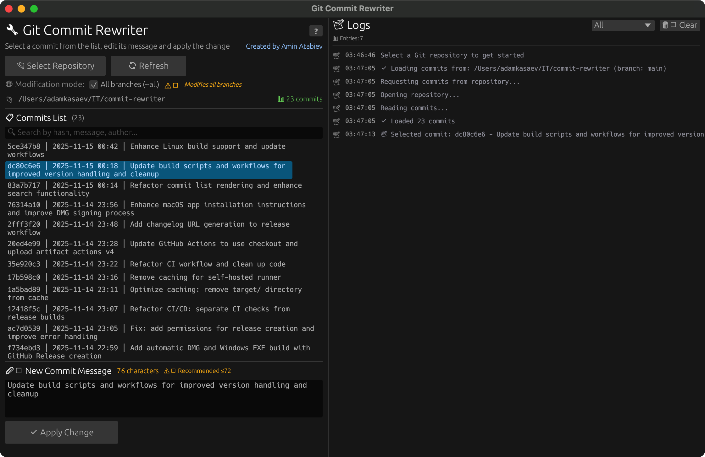

# 🦀 Git Commit Rewriter

[](https://opensource.org/licenses/MIT)
[](https://www.rust-lang.org/)
[](https://github.com/atabits/commit-rewriter)

> **Edit Git commit messages the easy way** — A beautiful, fast GUI app built with Rust



---

## ✨ Why You'll Love It

- **🎨 Beautiful Interface** — Clean, modern UI that's actually enjoyable to use
- **⚡️ Blazingly Fast** — Native Rust performance, launches in under 500ms
- **💾 Super Lightweight** — Only ~3MB in size, uses minimal memory
- **🔍 Smart Search** — Find commits instantly by message, hash, or author
- **🛡️ Safe by Default** — Automatic backups before any changes
- **🔄 Easy Rollback** — Undo changes with a single click
- **🌐 Cross-Platform** — Works on macOS, Linux, and Windows

---

## 🚀 Quick Start

### Download & Build

```bash
git clone https://github.com/atabits/commit-rewriter.git
cd commit-rewriter
cargo build --release
```

The app will be ready in `target/release/commit-rewriter` ✨

### Install Globally

```bash
# macOS / Linux
sudo cp target/release/commit-rewriter /usr/local/bin/

# Now run from anywhere
commit-rewriter
```

---

## 📖 How to Use

1. **🚀 Launch** — Run `commit-rewriter` from your terminal
2. **📂 Open Repo** — Click "Select Repository" and choose your project
3. **🔍 Find Commit** — Browse or search for the commit to edit
4. **✏️ Edit Message** — Type your new commit message
5. **✅ Apply** — Click "Apply Change" and review the preview
6. **🎉 Done!** — Confirm changes or rollback if needed

> **Tip:** After editing, push with `git push --force-with-lease`

---

## ⚠️ Important Notes

**⚡️ History rewriting changes commit hashes**

- 💾 Always backup your repository first
- 👥 Coordinate with your team before rewriting shared branches
- 🔒 Use `git push --force-with-lease` to push safely

**🛡️ Built-in Safety**

The app automatically creates backups in `refs/original/` before making changes. You can rollback anytime through the UI!

---

## 🛠️ For Developers

Need **Rust 1.70+** and **Git** installed.

```bash
# Development build
cargo build

# Release build (optimized)
cargo build --release

# Run with debug logs
RUST_LOG=debug cargo run

# Run tests
cargo test
```

### 📦 Build for Distribution

```bash
# macOS (Apple Silicon)
cargo build --release --target aarch64-apple-darwin

# Linux
cargo build --release --target x86_64-unknown-linux-gnu

# Windows
cargo build --release --target x86_64-pc-windows-gnu
```

---

## 📄 License

Released under the [MIT License](LICENSE) — free to use and modify!

---

## 💬 Get in Touch

**Built by Amin Atabiev**

- 📧 Email: [endlesspring.of@gmail.com](mailto:endlesspring.of@gmail.com)
- 🐙 GitHub: [@atabits](https://github.com/atabits)

---

<div align="center">

**⭐️ If you like this project, give it a star!**

Made with ❤️ and 🦀 Rust

</div>
